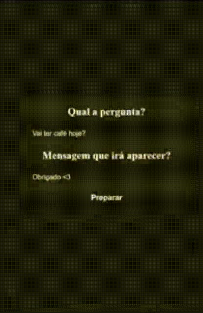

# Projeto Interativo - "Você me ama?"

Este projeto é uma página interativa e divertida com uma mecânica simples: quando o usuário tenta clicar no botão "NÃO", o botão escapa para um lugar aleatório na tela! O projeto também permite que o usuário defina perguntas e respostas personalizadas por meio da query string na URL.



---

## 🎯 Funcionalidades

- **Botão de Resposta Fugitivo:** O botão "NÃO" se move para um lugar aleatório quando o usuário tenta clicar.
- **Copiar Link:** Copia o link da página para a área de transferência com um clique.
- **Customização Dinâmica:** Permite definir perguntas e respostas usando parâmetros na query string.
- **Alerta Personalizado:** Exibe uma mensagem personalizada quando a resposta é SIM.

---

## 📋 Como Usar

1. **Clone este repositório:**

   ```bash
   git clone https://github.com/juanfariasdev/click-on-yes
   cd click-on-yes
   ```

2. **Abra o projeto no navegador:**

   ```bash
   open index.html
   ```

3. **Interação com o botão NÃO:** 
   - Tente clicar no botão "NÃO" e observe-o escapando pelo layout!

---

## 🛠️ Tecnologias Utilizadas

- **HTML5**: Estrutura da página
- **CSS3**: Estilização e layout
- **JavaScript**: Lógica interativa e manipulação do DOM

---

## 🎥 Demonstração


---

## 🚀 Funcionalidade de Copiar Link

Use o botão "Copiar Link" para compartilhar a URL personalizada da página com facilidade!

---

## 📄 Licença

Este projeto está sob a licença MIT - veja o arquivo [LICENSE](LICENSE) para mais detalhes.

---

## 💡 Sugestões de Melhorias

- Adicionar mais animações nos botões.
- Implementar um sistema de pontuação para quantas vezes o usuário tenta clicar no "NÃO".
- Adicionar uma opção de "Revanche" com mais interatividade.

---

## 👨‍💻 Contribuição

Sinta-se à vontade para enviar **pull requests** ou abrir **issues** para sugestões de melhorias.

---

## 📧 Contato

Entre em contato através do [LinkedIn](https://www.linkedin.com/in/juanfariasdev) ou envie um e-mail para **juanpablo.profissional.a.f@gmail.com**.

```
---